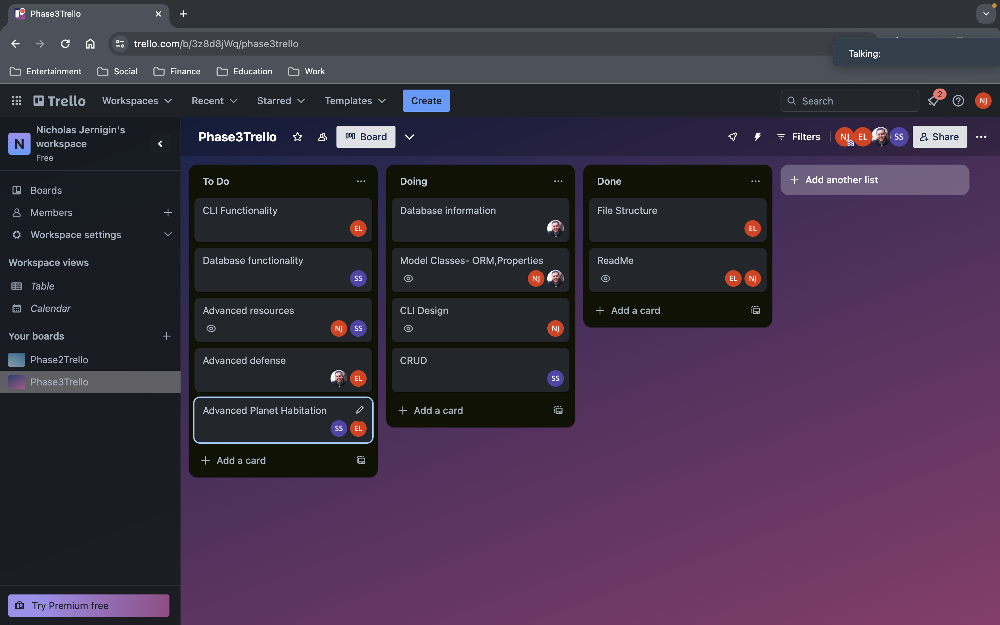

Space Pioneer

You are a Space Pioneer working for Space Tech, the leading company in planet devlopment. Your mission is to set out, create or discover habitable planets, and establish colonies for all of humankind!

CRUD:
Create and establish new outposts and planets
Read solar system/planet details and attributes 
Update planet names,attributes,etc...
Delete/remove planets from the solar system

Core Deliverables:

1.Solar Systems with unique planets in database are generated
2.User is able to establish Colonies on planets
3.User is able to create Planets/Stars with set features and attributes, via the Standard issue Space Pioneer Planet Creator Kit
	
Advanced Deliverables:

1.Colonies are able to produce resources, which in turn gives the user “turns”.
2.The user is able to purchase defenses for the planet, as Aliens have a chance to attack planets with colonies
3.Each planet's terrain affects the conditions required for a user to establish a colony.The user will need to purchase a higher level colony, which in turn produces more resources, but increases the percentage for alien attacks 

Classes:

Stars
Planets
Moons
Colonies

Trello:

	
